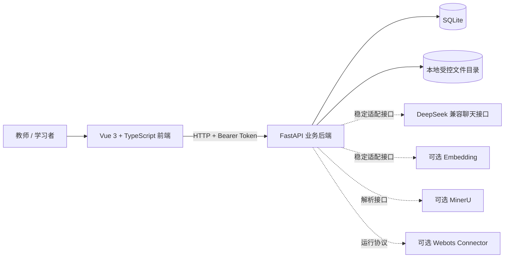

# EmbodTeachMS 具身课堂技术架构文档

## 1. 文档信息

| 项目 | 内容 |
| --- | --- |
| 文档编号 | 2.2 |
| 文档名称 | 技术架构文档 |
| 产品名称 | EmbodTeachMS 具身课堂 |
| 文档版本 | v0.6（最终提交版） |
| 项目阶段 | PoC / Stage 2 |
| 编制日期 | 2026-08-12 |
| 适用范围 | Vue 前端、FastAPI 后端、SQLite、本地文件、可选 AI/MinerU/Webots 集成 |

## 2. 架构目标与约束

本项目采用浏览器前端、FastAPI 单体后端和 SQLite 本地持久化的轻量架构，优先满足本地可运行、双角色闭环、权限清晰和数据可追溯四项要求。

核心约束如下：

1. 后端是身份、权限、状态迁移和确定性事实的唯一可信模块。
2. 前端通过统一 HTTP 接口访问业务能力，不直接访问数据库或文件目录。
3. 外部 AI、文档解析和 Webots 通过明确接缝接入，失败时不破坏核心教学数据。
4. PoC 采用单体部署，不引入微服务、消息队列、Redis 或 Kubernetes。
5. 接口响应统一使用 `ApiResponse[T]`，前端类型从 OpenAPI 生成。

## 3. 总体架构



### 3.1 部署拓扑

```text
现代桌面浏览器
  └─ Vite/Vue 前端（默认 127.0.0.1:45173）
       └─ HTTP + CORS + Bearer Token
            └─ Uvicorn/FastAPI（默认 127.0.0.1:38117）
                 ├─ SQLite：backend/data/course-agent.db
                 ├─ 上传文件：backend/data/knowledge-base-uploads
                 ├─ 可选聊天模型：OpenAI 兼容 HTTP
                 ├─ 可选文档解析：MinerU HTTP
                 └─ 可选仿真：Webots Connector 协议
```

## 4. 技术选型

| 层次 | 技术 | 版本/约束 | 选型说明 |
| --- | --- | --- | --- |
| 前端框架 | Vue | 3.5 | 适合单页工作台和组件化交互 |
| 前端语言 | TypeScript | 5.8，严格检查 | 通过类型约束降低接口漂移 |
| 构建工具 | Vite | 7.3 | 本地开发和生产构建流程简单 |
| 三维展示 | Three.js | 0.180 | 在浏览器内提供独立三维教学演示 |
| API 客户端 | openapi-fetch | 0.17 | 复用后端 OpenAPI 类型 |
| 后端框架 | FastAPI | 0.116 | 提供路由、Pydantic DTO 和 OpenAPI |
| 后端语言 | Python | 3.13 | 由 `.python-version` 和 `uv.lock` 固定 |
| 数据校验 | Pydantic | 2.11 | 统一请求和响应数据约束 |
| 数据库 | SQLite | 本地文件 | PoC 低运维持久化，支持事务与唯一约束 |
| 测试 | pytest / Playwright | 锁文件版本 | 覆盖后端领域与双角色浏览器流程 |

## 5. 模块、接口与接缝

本节使用“模块—接口—实现—接缝—适配器”描述架构。接口包含调用者必须知道的参数、状态约束、错误模式和配置，不局限于函数签名。

### 5.1 前端模块

| 模块 | 主要实现 | 对外接口与职责 |
| --- | --- | --- |
| 应用入口与认证 | `frontend/src/App.vue`、`AuthView.vue` | 注册、登录、恢复用户、失效会话回收 |
| 工作台壳层 | `WorkspaceView.vue` | 按角色和当前教学班组织导航与页面上下文 |
| API 客户端 | `src/api/client.ts`、`schema.d.ts`、`session.ts` | Bearer Token、统一响应解包、错误透传和类型安全请求 |
| 知识库工作台 | `KnowledgeBaseManagementPanel.vue` | 知识库、文档、分段、召回测试和班级导入 |
| 备课工作台 | `PreparationSessionPanel.vue`、`preparation-workbench.ts` | 文档选择、解析轮询、重点、题目、确认和发布 |
| 教师班级工作区 | `TeacherClassWorkspace.vue` 等 | 课程概述、班级分析、学习者证据、练习与作业管理 |
| 学习者工作区 | `LearnerClassWorkspace.vue` 等 | 课程学习、练习、作业、仿真和个人概览 |
| 三维演示 | `EmbodiedDemoWorkspace.vue` | 本地 Three.js 场景和分步教学任务 |

前端页面状态由页面模块持有；认证 Token 和请求错误由 API 客户端集中处理；备课解析轮询由备课协调模块统一管理。这样可以在页面切换或卸载时由一个位置停止轮询，避免状态逻辑分散。

### 5.2 后端模块

| 模块 | 主要实现 | 小接口背后的行为 |
| --- | --- | --- |
| 应用装配 | `backend/app/main.py`、`run.py` | 配置、路由、CORS、异常处理和生命周期装配 |
| 统一响应 | `app/common/dto/api_response.py` 等 | 成功/失败响应、错误码、request ID 和异常归一化 |
| 认证模块 | `app/auth/` | 密码哈希、账号角色、JWT 会话和当前用户 |
| 工作区模块 | `app/workspaces/` | 按角色返回可见入口和概要数据 |
| 文档解析模块 | `app/document_parsing/` | Markdown 规范化、结构块、解析限制和 MinerU 适配 |
| 知识库模块 | `app/knowledge_bases/` | 文档版本、分段、索引、检索、来源和教学班复制 |
| 教学班模块 | `app/teaching_classes/` | 班级、成员、准入、授权码、备课、发布和访问控制 |
| 学习评价模块 | 练习、掌握度、作业相关实现 | 客观判分、证据幂等、掌握度和作业状态 |
| LLM 网关 | `app/llm_gateway/` | 统一输入输出、供应商适配、超时和明确降级 |
| Webots 连接 | `app/webots_connector.py` | 配对、运行状态、命令、事件和结果协议骨架 |

### 5.3 关键接缝与适配器

| 接缝 | 稳定接口 | 当前适配器 | 替代/测试适配器 |
| --- | --- | --- | --- |
| HTTP 业务接缝 | FastAPI 路由 + Pydantic DTO | Uvicorn/FastAPI | TestClient / HTTP 测试 |
| 数据持久化接缝 | 领域方法与事务规则 | SQLite | 临时 SQLite 测试库 |
| 聊天模型接缝 | Chat Gateway 请求/响应 | DeepSeek OpenAI 兼容 HTTP | 固定响应或失败替身 |
| Embedding 接缝 | 文本到向量及状态 | 可配置 HTTP 模型 | 无向量降级/固定向量替身 |
| 文档解析接缝 | 文件到规范化结构块 | Markdown 本地解析、MinerU HTTP | 固定解析结果/失败替身 |
| 仿真接缝 | 配对、运行、事件、结果状态机 | Webots Connector 协议 | 协议测试替身 |

只有实际存在变化或测试替身的位置才保留接缝，避免为单一实现增加无收益的抽象层。

## 6. 数据模型与持久化

### 6.1 身份与教学组织

| 数据实体 | 关键内容 |
| --- | --- |
| users | 用户名、显示名、固定角色、密码哈希 |
| sessions | JWT 会话关联、有效期和注销状态 |
| teaching_classes | 教学班、教师归属、加入规则和课程元数据 |
| class_memberships | 正式成员关系，用户与班级唯一 |
| class_join_requests | 申请状态；申请中不产生成员权限 |
| class_authorization_codes | 班级授权码、启用状态和失效时间 |

### 6.2 知识库与检索

| 数据实体 | 关键内容 |
| --- | --- |
| knowledge_bases | 教师级知识库或教学班副本、归属和来源关系 |
| knowledge_base_documents | 文档元数据、Markdown、版本和解析状态 |
| knowledge_base_document_sources | 受控原始文件路径 |
| knowledge_base_settings | 分段模式、长度、重叠和分隔规则 |
| knowledge_base_blocks | 结构块、标题路径和来源位置 |
| knowledge_base_chunks | 可检索分段、文档版本和索引状态 |
| knowledge_base_chunk_embeddings | 模型、维度、向量和失败状态 |
| knowledge_base_chunks_fts | SQLite FTS5 关键词索引 |

### 6.3 备课、发布与学习事实

| 数据实体 | 关键内容 |
| --- | --- |
| preparation_sessions | 教学班备课状态、选中文档和发布草稿 |
| preparation_session_paragraphs | 装载段落及其来源 |
| highlights / questions | 教师重点、候选题、确认状态和来源 |
| course_contents | 已发布正文、练习、作业和版本快照 |
| course_content_completions | 学习者课程完成记录 |
| practice attempts | 课堂练习和基准练习的确定性作答证据 |
| homework submissions | 草稿、提交、迟交和客观题结果 |
| webots runs/events | 运行状态、事件序列和结果 |

## 7. 统一接口契约

### 7.1 响应 DTO

所有 HTTP 成功和失败响应统一为：

```json
{
  "code": "OK",
  "message": "请求成功",
  "data": {},
  "requestId": "uuid"
}
```

- 字段采用 camelCase。
- 失败时 `data` 为 `null`。
- 后端接收或生成 `X-Request-Id`，并在响应头和响应体返回。
- 前端错误对象保留业务错误码、消息、request ID 和 HTTP 状态。

### 7.2 主要接口组

| 接口组 | 代表路径 | 职责 |
| --- | --- | --- |
| 认证 | `/api/auth/register`、`login`、`me`、`logout` | 账号和会话 |
| 工作区 | `/api/workspaces/teacher`、`learner` | 返回角色入口数据 |
| 知识库 | `/api/knowledge-bases` | 知识库和文档管理 |
| 分段检索 | `/segments/preview`、`rebuild`、`retrieval-tests` | 预览、建索引和召回验证 |
| 教学班 | `/api/teaching-classes` | 班级、准入、成员和授权码 |
| 备课发布 | `/preparation-session` 及其子路径 | 资料、重点、题目和发布 |
| 学习活动 | `/published-contents`、`practice-detail`、`homework` | 学习、练习和作业 |
| 教师分析 | `/teacher-dashboard`、`learners` 等 | 聚合统计和个人依据 |
| AI | `/api/xiaod/chat`、候选题接口 | 受权限和课程范围约束的 AI 能力 |
| Webots | `/webots/...` | 配对、运行、命令、事件和结果 |

## 8. 核心数据流

### 8.1 资料摄入与检索

```text
上传受控文件
  → 创建文档与版本
  → Markdown 本地解析或可选 MinerU 解析
  → 生成结构块
  → 预览分段规则
  → 教师确认并重建
  → 写入 chunks + FTS5 + 可选向量
  → 执行 Top-K 召回测试
```

解析、Embedding 或索引失败必须保存可识别状态和原因，不能使用空向量或零结果伪装成功。

### 8.2 教学班复制与备课发布

```text
选择来源文档
  → 校验教师与目标教学班归属
  → 复制原始文件和来源元数据
  → 目标副本独立解析与索引
  → 备课会话选择可用文档
  → 保存重点和题目
  → 校验发布门槛
  → 生成发布快照
```

### 8.3 学习与分析

```text
正式成员读取发布内容
  → 标记完成 / 完成练习 / 提交作业
  → 后端确定性校验与判分
  → 保存幂等学习证据
  → 计算个人概览和班级聚合
  → 教师读取权限范围内的结构化依据
```

## 9. 安全设计

- JWT 密钥长度至少 32 字符，密钥仅来自环境变量或本地受控运行文件。
- 密码以随机盐哈希保存，数据库不保存明文密码。
- 所有资源操作校验用户角色、资源归属、教学班成员关系和状态。
- 对调用者不应知道是否存在的越权资源，按不可见资源处理。
- 上传文件限制格式、大小、路径、解析时长和输出规模；不执行上传内容。
- CORS 只允许显式配置的前端来源。
- 日志记录方法、路径、状态、耗时和 request ID，不记录凭证或完整业务正文。

## 10. 可靠性与错误处理

- 关键关系使用唯一约束避免重复成员、完成记录和事件。
- 多实体状态变化使用事务，避免只写入一半。
- 前端把后端业务错误消息转成可操作提示，不使用静默刷新掩盖失败。
- 备课轮询在页面离开或组件卸载时停止。
- 外部模型和解析器具有超时、非法响应校验和明确降级。
- 发布快照与来源版本绑定，后续知识库变更不污染历史内容。

## 11. 构建、测试与质量门槛

### 11.1 后端

```powershell
cd backend
uv run pytest
```

重点验证认证、统一响应、权限、教学班准入、知识库、备课发布、练习、掌握度、作业、LLM 网关和 Webots 协议。

### 11.2 前端

```powershell
cd frontend
npm.cmd run typecheck
npm.cmd run build
npm.cmd run test:e2e
```

TypeScript 编译错误属于阻断项；OpenAPI 类型必须与后端路由保持一致。

### 11.3 发布门槛

- 核心双角色流程可连续完成。
- 统一 DTO 和 OpenAPI 类型检查通过。
- 不存在已知越权读取或跨班写入。
- 外部依赖未配置时有明确降级说明。
- README 和产品使用指南中的启动参数与脚本一致。

## 12. 当前边界与演进方向

当前 SQLite、本地文件和进程内任务方式适用于单机 PoC。生产化前需要重新决策：

1. SQLite 到 PostgreSQL 的迁移时机和迁移脚本。
2. 本地上传目录到对象存储的资源生命周期。
3. 进程内后台任务到持久化任务队列的失败恢复。
4. MinerU 正式版本、部署拓扑和返回契约。
5. Embedding 模型、向量维度和生产检索基础设施。
6. Webots 真实任务包、Controller 和评价协议。
7. 模型成本、速率限制、审计与运行观测。

## 13. 关联交付物

- `2.1_产品需求文档_PRD_v0.6.md`
- `2.3_项目实施方案.md`
- `2.4_项目计划书.md`
- `2.5_产品使用指南.md`
